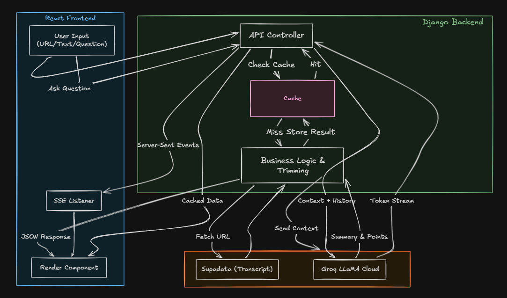

<h1>Nexus</h1>

<i>Paste a YouTube link or raw text — AI reads it, summarizes it, and answers your questions about it.</i>

---

## Overview

Nexus is a full-stack AI learning assistant where you drop a YouTube URL or paste any text — the rest is handled automatically. The backend fetches the transcript via Supadata, sends it to Groq's LLaMA model for analysis, and streams responses back in real time.

Built to demonstrate production-grade concepts: streaming HTTP responses, in-memory caching, SSE (Server-Sent Events), Python generators, and a clean React frontend with math and flowchart rendering.

---

## Core Features

| Feature | Description |
|---|---|
| YouTube Transcript | Fetches full transcript from any YouTube video via Supadata API |
| AI Analysis | Groq LLaMA generates summary, key points, and a rich chat context |
| Streaming Chat | Responses stream token-by-token using SSE and Python generators |
| In-Memory Cache | MD5-keyed cache avoids redundant AI calls for the same content |
| Raw Text Support | Paste any article, notes, or transcript directly |
| Math Rendering | KaTeX renders inline and block math expressions |
| Flowchart Rendering | Mermaid-powered flowcharts rendered from AI output |
| Chart Support | Recharts-based data visualizations from AI responses |
| Syntax Highlighting | Code blocks with language-aware syntax highlighting |
| API Key Modal | Groq and Supadata keys stored locally — no backend auth needed |

---

## Tech Stack

### Backend

  
  
  
  
  
  

### Frontend

  
  
  
  
  
  
  

### Deployment

  
  

---

## System Architecture

---

## Live Demo

> **[nexus.abdnoman.com](https://nexus.abdnoman.com)** — No setup needed. Just bring your own Groq and Supadata API keys.

---

**Abdullah Al Noman** · CSE Student · Full Stack Developer

